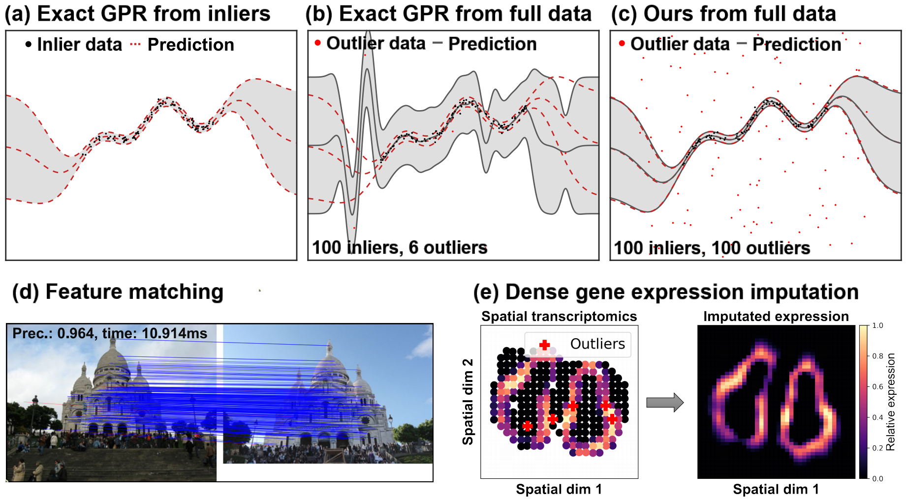

# Robust-Scalable-GPR
Official implementation of the CVPR23 paper: <a herf="https://openaccess.thecvf.com/content/CVPR2023/papers/Lu_Robust_and_Scalable_Gaussian_Process_Regression_and_Its_Applications_CVPR_2023_paper.pdf" target="_blank">Robust and Scalable Gaussian Process Regression and Its Applications</a>. 

More code including feature matching, dense gene expression imputation, and other experiments will be released soon. 

## Introduction



## Citation
If you find this work helpful, please consider citing:
```bibtex
@inproceedings{lu2023robust,
  title     = {Robust and Scalable Gaussian Process Regression and Its Applications},
  author    = {Lu, Yifan and Ma, Jiayi and Fang, Leyuan and Tian, Xin and Jiang, Junjun},
  booktitle = {Proceedings of the IEEE/CVF Conference on Computer Vision and Pattern Recognition (CVPR)},
  month     = {June},
  pages     = {21950--21959},
  year      = {2023}
}
```